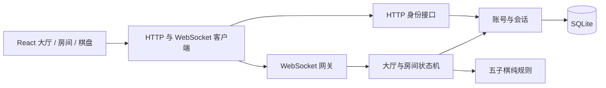
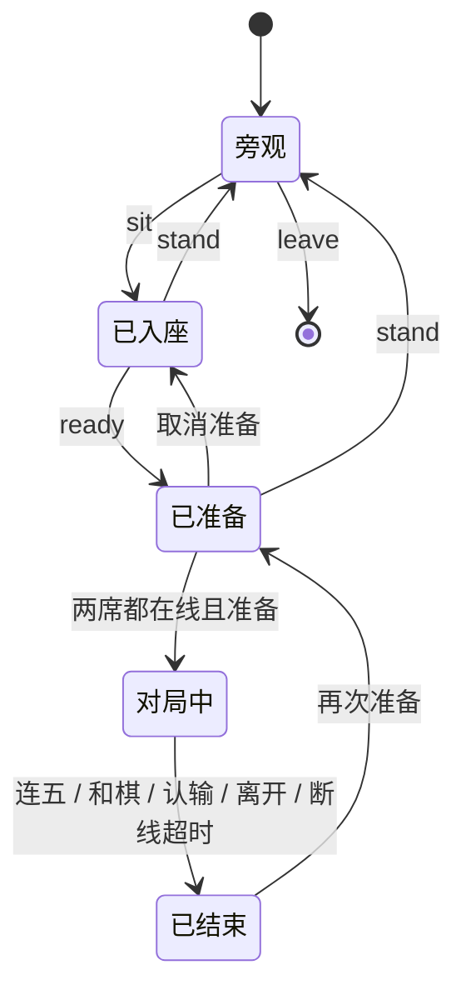

# 架构与迭代路线

首个纵向切片是“身份 → 大厅 → 房间 → 双人对局 → 战绩”。先用一个进程将完整链路跑通，让后续功能沿现有边界生长。

## 模块责任

| 模块                 | 当前职责                                                 | 扩展位置                                             |
| -------------------- | -------------------------------------------------------- | ---------------------------------------------------- |
| `src/App.tsx`        | 客户端外框、筛选收藏、账号表单、全局导航                 | 大厅场景与右侧面板已分离；后续继续抽出身份表单和聊天 |
| `src/components`     | 棋盘、房间、练习、弹窗、棋桌大厅、房间树与玩家表格       | 游戏专属 renderer；保持棋盘不感知网络                |
| `src/lib/client.ts`  | 同源 API、会话启动、连接、退避重连、快照、命令           | 协议版本、命令 ACK、增量事件与网络监测               |
| `shared/protocol.ts` | 游戏目录、用户/房间/棋局 DTO、命令联合类型               | 前后端统一的数据契约                                 |
| `shared/gomoku.ts`   | 无 I/O 的落子、胜负和本地电脑选点                        | 游戏规则与独立单元测试                               |
| `server/app.ts`      | HTTP 与 WebSocket 适配、认证、同源校验、限流、广播、心跳 | 网关与传输层                                         |
| `server/hall.ts`     | 身份到房间映射、席位、准备、回合、胜负和离线处理         | 房间应用服务；不依赖 React 或 socket 对象            |
| `server/accounts.ts` | scrypt、SQLite 账号/会话/结果存储                        | 替换持久化实现、扩展账号服务                         |

## 服务端权威

客户端只能提交意图。服务端从会话确定操作者，校验席位、当前对局 ID、轮次、位置、双方在线状态。客户端不允许自报昵称、棋子颜色、胜负或积分。落子按 Node 事件循环顺序处理；在单实例内，同座位抢占和同格落子只会有一个成功。

每次有效命令后广播完整快照，重连后也获取完整快照。这简化了首版一致性，没有客户端乐观落子。现在每个客户端会收到所有房间棋盘；未来牌类游戏有私有手牌，**必须改成按玩家投影的公开/私有快照**，不可直接套用当前广播。

结果以 match ID 做唯一键，在同一 SQLite 事务中写结果与增减战绩，防止重复结算。当前只存结果摘要，尚未存每手棋谱。

## 房间生命周期

连接与玩家分开：同一个玩家可以有多个 socket，只有最后一个断开才标记离线。30 秒内重新连接沿用原席位，断线期间服务端拒绝落子。超时离开并结算负局。没有自动走棋和每步时间限制，避免首版引入分布式计时。

## 分阶段继续开发

| 阶段                 | 内容                                                              | 完成标准                                     |
| -------------------- | ----------------------------------------------------------------- | -------------------------------------------- |
| 已交付：可运行基础   | 经典客户端大厅、游客/账号、实时房间聊天、五子棋、人机、结果持久化 | 独立会话可完成一局；刷新恢复；结果重启保留   |
| 下一步：可靠对局     | 完整棋谱、逐步事件序号、局内计时、会话过期提示、服务重启恢复      | 停止再启动服务仍可还原对局；客户端掉包可补齐 |
| 下一步：完整账号体验 | 游客账号转正、密码找回、好友、最近对手、个人战绩页                | 注册保留游客身份；账号与好友行为有集成测试   |
| 下一步：第二款游戏   | 优先中国象棋；抽象游戏引擎与棋盘 renderer                         | 一条大厅流程可运行两套不同规则               |
| 后续：牌类游戏       | 斗地主的 3 人桌与麻将的 4 人桌、发牌、私有手牌、回合阶段          | 观众和其他玩家无法获取非公开手牌             |
| 后续：上线能力       | HTTPS、正式域名、备份、结构化日志、指标、错误追踪、容量测试       | 可部署、可观测、可恢复，有确定的负载上限     |

第二款游戏接入时，将当前 `Room.seats` 二元组扩展为可变席位，`Match` 改成按 gameId 区分的联合类型，提取 `GameEngine { create, validateAction, applyAction, result, projectForPlayer }`。现在不制造空引擎或虚构游戏实现。

先保持一个 Node 服务。如果需要多个实例，房间应有唯一归属进程，连接网关按 roomId 路由；在线状态与跨实例通知可迁移到 Redis，账号/结果迁移到 PostgreSQL。不能直接开多个现有进程并依赖各自内存，否则会出现两份大厅。

技术参考：[Node.js SQLite 官方说明](https://nodejs.org/api/sqlite.html)、[ws 官方项目文档](https://github.com/websockets/ws)。SQLite 使用 Node 内置模块，项目要求 Node 24+；该 API 的稳定状态随 Node 版本变化，升级运行时后需重跑持久化测试。
