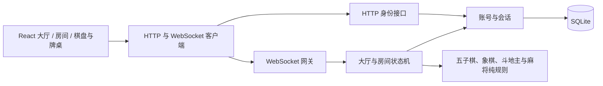
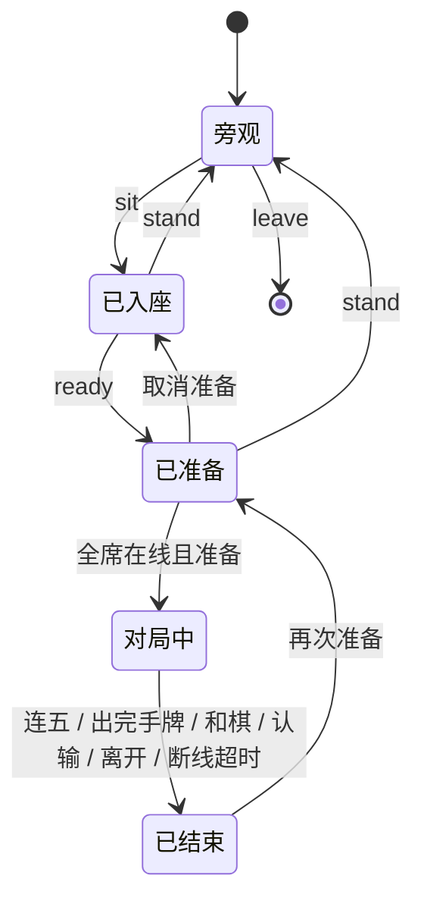

# 架构与迭代路线

首个纵向切片是“身份 → 大厅 → 房间 → 双人对局 → 战绩”。先用一个进程将完整链路跑通，让后续功能沿现有边界生长。

## 模块责任

| 模块                               | 当前职责                                                 | 扩展位置                                  |
| ---------------------------------- | -------------------------------------------------------- | ----------------------------------------- |
| `src/App.tsx`                      | 客户端外框、筛选收藏、全局导航                           | 账号表单、身份会话和账号中心已分离        |
| `src/components`                   | 棋盘、房间、练习、弹窗、棋桌大厅、房间树与玩家表格       | 游戏专属 renderer；保持棋盘不感知网络     |
| `src/lib/client.ts`                | 同源 API、会话启动、连接、退避重连、快照、命令           | 协议版本、命令 ACK、增量事件与网络监测    |
| `src/lib/identity.ts`              | 身份启动、自动续期、多标签页同步、会话变化后重连         | 不在浏览器持久化 token                    |
| `src/components/AccountCenter.tsx` | 资料、邮箱、密码、设备和注销界面                         | 保持属性窗口风格                          |
| `server/account-routes.ts`         | 账号 HTTP 适配、当前会话授权、邮件工作流                 | 增加账号验证渠道                          |
| `server/mail.ts`                   | 独立本地收件箱和 SMTP 发送适配                           | 真实发送通过配置启用                      |
| `shared/protocol.ts`               | 游戏目录、用户/房间/棋局 DTO、命令联合类型               | 前后端统一的数据契约                      |
| `shared/gomoku.ts`                 | 无 I/O 的落子、胜负和本地电脑选点                        | 游戏规则与独立单元测试                    |
| `shared/doudizhu.ts`               | 牌型、比较、叫分、出牌、团队结算、私有视图与基础电脑策略 | 联机与本地练习共用纯规则                  |
| `src/components/DoudizhuTable.tsx` | 牌桌、选牌、叫分、出牌提示                               | 房间与本地练习共用呈现，不依赖网络        |
| `server/app.ts`                    | HTTP 与 WebSocket 适配、认证、同源校验、限流、广播、心跳 | 网关与传输层                              |
| `server/hall.ts`                   | 身份到房间映射、席位、准备、回合、胜负和离线处理         | 房间应用服务；不依赖 React 或 socket 对象 |
| `server/accounts.ts`               | scrypt、SQLite 账号/会话/结果存储                        | 替换持久化实现、扩展账号服务              |

## 服务端权威

客户端只能提交意图。服务端从会话确定操作者，校验席位、当前对局 ID、轮次、位置或持牌、全员在线状态。象棋、斗地主与麻将还校验 revision，拒绝旧命令及重复执行。客户端不允许自报昵称、棋子颜色、胜负或积分。操作按 Node 事件循环顺序处理；在单实例内，同座位抢占和同格落子只会有一个成功。

每次有效命令后广播完整快照，重连后也获取完整快照，没有客户端乐观落子/扣牌。`Hall.snapshot(userId)` 逐玩家投影：五子棋和象棋棋盘公开，斗地主通过 `doudizhuView` 白名单构建 DTO，只给已入座玩家返回本人 `hand`，观众和其他房间玩家得到空数组。绝不广播包含三家 `hands` 的内部状态。叫分未结束时，临时最高叫分人不作为正式地主暴露，三张底牌仍为空；叫分取消后也不公开底牌。

结果以 match ID 做唯一键，在同一 SQLite 事务中写结果与更新战绩，防止重复结算。五子棋和象棋沿用原结果表，以 `game` 区分；斗地主使用 `card_results` 和 `card_result_players`，一次事务保存阵营、底分/倍数/春天、三人角色与得分，并更新三人的胜负。账号胜负暂为四款游戏合计；得分只属于本局，无余额。注销时参与者 user_id 置空，保留匿名结果与其他人的记录。当前只存结果摘要，尚未存每手棋谱或出牌记录。

## 房间生命周期

`Room` 按 game 区分：五子棋二元组席位与 `Match`，象棋二元组席位与 `XiangqiState`，斗地主三元组席位与 `DoudizhuView`；麻将四元组席位与 `MahjongView`；服务端使用 `Room<DoudizhuState, MahjongState>` 保存完整手牌。斗地主外层 `status=playing` 覆盖叫分和出牌，内部 `phase` 为 bidding → playing → finished，三人不叫会重新发牌并增加 revision/deal。

连接与玩家分开：同一个玩家可以有多个 socket，只有最后一个断开才标记离线。30 秒内重新连接沿用原席位与本人手牌，断线期间服务端拒绝操作。斗地主叫分时离开或超时取消本局且不计战绩，出牌时按阵营判负；农民退出会影响队友。没有联机托管和每步时间限制。

## 分阶段继续开发

| 阶段                 | 内容                                                              | 完成标准                                     |
| -------------------- | ----------------------------------------------------------------- | -------------------------------------------- |
| 已交付：可运行基础   | 经典客户端大厅、游客/账号、实时房间聊天、五子棋、人机、结果持久化 | 独立会话可完成一局；刷新恢复；结果重启保留   |
| 下一步：可靠对局     | 完整棋谱、逐步事件序号、局内计时、服务重启恢复                    | 停止再启动服务仍可还原对局；客户端掉包可补齐 |
| 已交付：账号生命周期 | 游客转正、邮箱验证/找回、资料、会话、锁定和注销                   | 旧库迁移与账号安全流程有集成测试             |
| 后续：玩家社交       | 好友、最近对手、个人战绩页                                        | 账号与好友行为有集成测试                     |
| 已交付：斗地主       | 三人桌、叫分/出牌、私有手牌、团队结算、素材、本地电脑练习         | 真实三客户端完整对局，旁观与重连权限测试通过 |
| 已交付：中国麻将     | 四人麻将、私有手牌、吃碰杠胡、练习与素材                          | 复用身份、房间、聊天与结算，保持手牌隔离     |
| 后续：上线能力       | HTTPS、正式域名、备份、结构化日志、指标、错误追踪、容量测试       | 可部署、可观测、可恢复，有确定的负载上限     |

四款游戏当前使用明确的联合类型与各自纯规则函数，在大厅层分派准备、操作、投影和结算；后续出现更多重复生命周期后再提取通用引擎接口。斗地主服务端使用 `crypto.randomInt` 驱动 Fisher–Yates 洗牌；本地练习使用本地随机与同一规则状态机，不上报账号战绩。提示与电脑策略只接收本人手牌和公开信息，不读取对手手牌。

先保持一个 Node 服务。如果需要多个实例，房间应有唯一归属进程，连接网关按 roomId 路由；在线状态与跨实例通知可迁移到 Redis，账号/结果迁移到 PostgreSQL。不能直接开多个现有进程并依赖各自内存，否则会出现两份大厅。

技术参考：[Node.js SQLite 官方说明](https://nodejs.org/api/sqlite.html)、[ws 官方项目文档](https://github.com/websockets/ws)。SQLite 使用 Node 内置模块，项目要求 Node 24+；该 API 的稳定状态随 Node 版本变化，升级运行时后需重跑持久化测试。

## 账号数据与一致性

数据库自动迁移到 `user_version=2`，采用增量字段和索引，不重建或清空原表。游客转正更新原用户行，保留 ID、战绩和对局引用，并撤销游客旧会话，创建正式会话。

`users` 保存私有邮箱、头像编号、积分（默认 1000）和凭证版本；`sessions` 保存 token 哈希、公开会话 ID、设备摘要、创建/活动/到期时间；`verifications` 保存随机令牌哈希、用途、目标邮箱、凭证版本与到期时间；`login_failures` 按稳定用户 ID 累计失败，昵称和邮箱别名共用计数。

密码计算异步进行，提交前重新验证会话和凭证版本；转正、密码变化、重置令牌消费及注销在 SQLite 事务中完成。并发密码重置仅一个成功。敏感凭证变化会清理旧令牌并关闭失效会话的 WebSocket（4001）。昵称、头像通过大厅快照同步，邮箱始终是私有字段。

**积分系统**：在线对局结算时同事务更新玩家积分。五子棋/象棋：赢家 +10，输家 -10，和棋 0；斗地主/麻将：各玩家的娱乐分（底分×倍数、自摸/点炮等）乘 10 作为大厅积分变化。积分下限为 0（使用 `MAX(0, points+delta)` 确保不会负数）。单机练习不影响积分。结果记录使用 `INSERT OR IGNORE` 确保幂等性，同一 match ID 重复结算不会重复扣分。排行榜按积分降序、胜局次序排列，仅展示正式账号（游客不入榜）。

会话空闲期限 7 天，绝对期限 30 天；前端每 5 分钟及恢复焦点时续期，后台记录设备活动时间。续期保留当前 token，避免同浏览器标签页抢换 token；转正和改密会生成新 token。页面收到 4001 后重新确认 Cookie 对应身份，防止误把刚完成的登录清空。

本地邮件收件箱使用独立 loopback HTTP 端口，不暴露应用内的邮件读取接口；邮件仅存内存。SMTP 使用 Nodemailer 适配，默认不发送真实邮件。匿名的找回请求对存在/不存在的有效邮箱返回相同响应，实际发送在后台完成，失败日志不包含地址和验证令牌。

安全实现参考：[OWASP Authentication](https://cheatsheetseries.owasp.org/cheatsheets/Authentication_Cheat_Sheet.html)、[Forgot Password](https://cheatsheetseries.owasp.org/cheatsheets/Forgot_Password_Cheat_Sheet.html)、[Session Management](https://cheatsheetseries.owasp.org/cheatsheets/Session_Management_Cheat_Sheet.html)、[Nodemailer SMTP](https://nodemailer.com/smtp)。

## 聊天持久化与交互

`server/chat.ts` 负责消息、幂等编号、游标分页、未读位置和自建房间编号；与账号共用 SQLite 连接，账号注销通过外键级联清理消息与已读位置。`server/chat-routes.ts` 只暴露已认证的历史/已读接口；发送沿用 WebSocket，由 `Hall.chatChannel` 验证当前房间权限，成功写入后返回独立确认事件。

`src/components/ChatPanel.tsx` 管理频道、历史分页、滚动和未读界面；`src/lib/useChatOutbox.ts` 管理确认、超时、失败与重试，按账号隔离、按标签页存储待发内容；`src/lib/chat-state.ts` 提供排序去重、历史区间合并和待发恢复逻辑。大厅/房间各自缓存历史，离房后丢弃该房间展示缓存。原有 `App.tsx` 聊天表单已抽出。

新增表均使用幂等创建：`chat_messages`、`chat_reads`、`room_sequence`、`chat_revision`、`default_rooms`。消息用自增 seq 排序、`(user_id,client_id)` 去重，索引覆盖频道历史和发送人时间查询。五子棋默认房间 1001–1012 固定；象棋、斗地主各六个默认桌首次从递增序列分配 ID，并通过 `default_rooms` 保存名称到 ID 的稳定映射，避免占用既有自建房间的历史频道。自建房间编号同样递增，重启不复用。聊天记录已持久化，房间本身、棋谱和进行中对局仍是内存状态。

聊天当前仍随大厅快照提供最新页面；后续人数增多时可改为频道增量推送。此轮没有实现私聊、举报或禁言。

## 中国象棋

已交付：双人房间、单机练习、规则验证、求和、棋谱和素材；可继续按独立游戏边界扩展完整棋例裁定与持久化棋谱。

`shared/xiangqi.ts` 提供无 I/O 的初始棋盘、合法走法、将军检查、不可变状态推进、终局和有限深度 alpha-beta 电脑。红方为 1、黑方为 2，棋盘从黑方左上角按行编号 0–89。`XiangqiPosition` / `XiangqiBoard` 在房间和练习中共用；坐标、交点、点击区与棋子在翻转时使用同一映射。练习电脑在独立 Worker 中运行，悔棋、重开和退出会终止旧计算。

`xq:*` 命令要求当前 matchId/revision，求和由对手回应，继续走棋撤销请求。服务端保留完整公开棋谱和重复局面键；只将终局摘要与胜负写入 SQLite。`results.game` 增量迁移默认 gomoku；历史列 black_id/white_id 对象棋分别代表第 0 席红方、第 1 席黑方。没有重建旧表。

素材分为两张 imagegen 木纹 WebP、精确棋盘 SVG 与 14 张棋子字层；大厅将棋盘映射到原分层木桌的桌面位置，保留座椅与人物遮挡顺序。源图、提示词和可重建清单位于 xiangqi-v1 目录。

## 四人麻将

`shared/mahjong.ts` 是无 I/O 的 136 张牌状态机：分为 discard → claim → discard / finished。胡牌使用顺子／刻子拆分与七对、十三幺判断；所有修改均生成新状态，便于测试未授权动作不改变局面。服务端使用 `crypto.randomInt` 洗牌，本地练习复用规则，由三个仅接收私人视图的电脑操作。

`mahjongView` 明确列出可公开字段，隐藏完整牌墙、其他人的手牌、暗杠内容、吃碰杠胡资格与回复。碰和吃不摸牌；明杠／暗杠／补杠从墙尾补牌。补杠在抢杠窗口内将第四张牌暂存公开弃牌区，只有无人胡牌后才升级副露；各状态下 136 张实体牌归属保持唯一。

响应窗口内部记录 `openedAt` revision，服务端允许该窗口内不同玩家使用相同版本并发回应，同时拒绝跨窗口旧消息及同人重复回复。收齐可回应者的选择后，再按优先级与座位距离结算，不由到达顺序决定谁吃碰胡。

`MahjongTable` 与 `MahjongTile` 由联机房间和单机练习共用。界面按本人席位旋转四方布局；34 种 SVG 牌字叠加共享 WebP 牌面，桌布和大厅桌椅各为独立 WebP。手机保留 2:3 手牌比例与原生横向滚动，牌河可展开；所有素材清单与生成提示词随代码保存。

新增 `mahjong_results` 与 `mahjong_result_players`，用 match ID 去重，在一个事务内保存结束类型、胡牌／放铳席位、每人胜负和得分并更新账号。点炮未涉及的两人中立，流局不增加胜负，退出中止只给退出者记负。四款游戏共享账号的总胜负，得分不是余额。默认桌总数为 30，自建房间总上限调整为 60；原默认桌编号保持不变。
